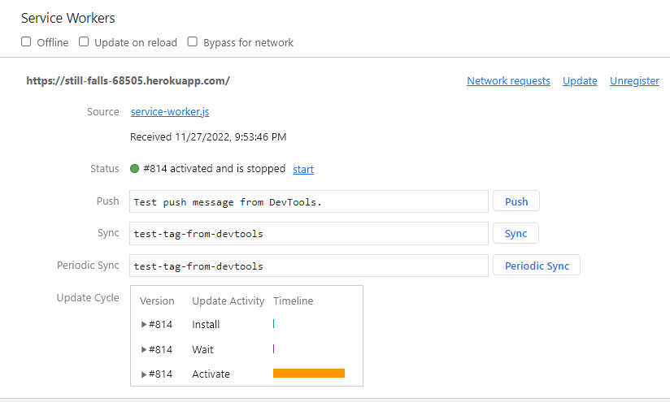
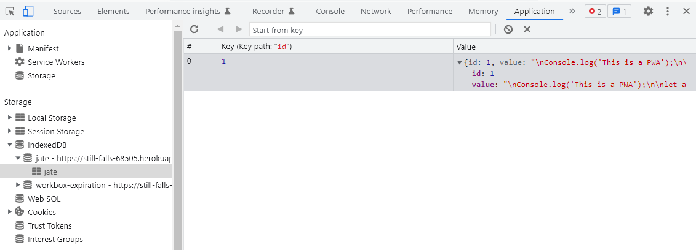

# PWA -  TEXT EDITOR  

## Table of Contents
- [Description](#description)
- [Usage](#usage)  
- [Questions](#questions)  
  

## Description  

[Deployed Aplication](https://still-falls-68505.herokuapp.com/)

PWA Text Editor is a coding text editor that has properties of a progressive web application.
- Service worker, wich allows to retain data to expedice rendering of a web page.
- Manifest JSON that allow the app to be installled and run as a native app.
- The app saves information using the browser indexed DB.
  

  

## Questions
Please refer to my GitHub profile for more information: https://github.com/lalo79  
If you have questions, you can reach me via e-mail: epacheco.leines@gmail.com   

